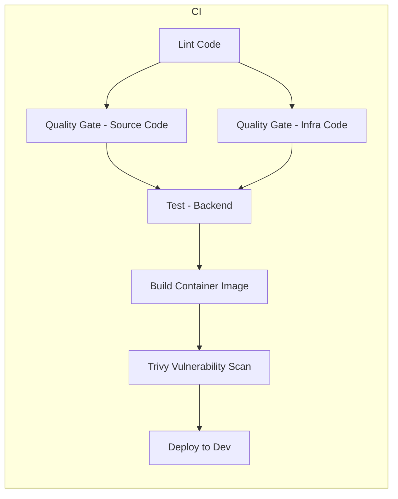

# Digital Step Flow - Backend

Backend Express/Node.js da plataforma Digital Step Flow.

## Stack Tecnológico

- Node.js v24.13.0 com Express
- TypeScript para segurança de tipos
- JWT para autenticação
- bcrypt para hash de senhas
- Zod para validação de schemas
- Helmet para cabeçalhos de segurança

## Desenvolvimento Local

Para **desenvolvimento com Docker Compose** (backend + frontend + Postgres + Redis + observabilidade: Prometheus, Grafana, Loki, Tempo), veja [docs/local-development.md](./docs/local-development.md). Resumo:

- **Stack completa:** clone o frontend ao lado do backend (`../pucrs-tcc-digital-step-flow-frontend`) e execute `docker compose up -d` na raiz do backend.
- **Só backend + infra:** `docker compose -f docker-compose.backend-only.yml up -d` (frontend pode rodar com `npm run dev` no repo do frontend).

### Como desenvolver o backend (sem Docker)

1. **Pré-requisitos:** Node.js v24.13.0, npm 11.6.3. Opcional: Docker, PostgreSQL para testes locais.
2. **Instale dependências e suba o servidor:**

```bash
npm install
npm run dev
```

O backend estará em **http://localhost:8080**. Crie um `.env` na raiz (veja [docs/local-development.md](./docs/local-development.md) ou `env.example`).

3. **Scripts úteis:**

```bash
npm run dev          # Desenvolvimento (hot reload)
npm run build        # Build para produção
npm start            # Executar aplicação compilada
npm test             # Testes
npm run test:coverage # Testes com cobertura
npm run lint         # Linter
```

### Desenvolvendo backend e frontend juntos

- **Backend:** `npm run dev` neste repositório → http://localhost:8080  
- **Frontend:** no repositório [pucrs-tcc-digital-step-flow-frontend](https://github.com/raphaelmoraes/pucrs-tcc-digital-step-flow-frontend), `npm run dev` → http://localhost:3000  
- No frontend, use `VITE_API_BASE_URL=http://localhost:8080/api` no `.env` para apontar para o backend local.

## Estrutura do Projeto

```
src/
├── controllers/    # Controladores de rotas
├── middleware/     # Middlewares Express
│   ├── auth.middleware.ts
│   ├── errorHandler.ts
│   ├── requestLogger.middleware.ts
│   └── validateRequest.ts
├── routes/         # Definição de rotas
├── repositories/   # Camada de acesso a dados
├── schemas/        # Schemas de validação (Zod)
├── utils/          # Utilitários (logger, etc.)
└── index.ts        # Ponto de entrada
```

## Kubernetes

Os manifests Kubernetes estão em `k8s/` e incluem:
- Deployment
- Service
- Kustomization (usa remote base do repositório principal)

## Argo CD

A application do Argo CD está em `argocd/application.yaml` e aponta para este repositório.

## Build Docker

```bash
# Build local
docker buildx bake -f docker-bake.hcl --load

# Build com versão específica
docker buildx bake -f docker-bake.hcl --load \
  --set backend.args.BACKEND_IMAGE_VERSION=1.0.0 \
  --set backend.args.BASE_IMAGE_VERSION=1.0.0
```

## Logging

O backend usa logging estruturado em JSON. Veja [docs/logging.md](./docs/logging.md) para mais detalhes.

## Health Check

O endpoint `/health` está disponível para verificar o status do serviço:

```bash
curl http://localhost:8080/health
```

## Versionamento

Este projeto segue [Semantic Versioning 2.0.0](https://semver.org/).

Para criar uma release:
```bash
git tag -a v1.0.0 -m "Release version 1.0.0"
git push origin v1.0.0
```

## GitHub Actions

### Diagrama do pipeline CI

O pipeline CI (`.github/workflows/ci.yml`) roda em **push** e **pull_request** para `develop` e em tags `v*.*.*`:



| Job | Descrição |
|-----|-----------|
| **Lint Code** | ESLint no código TypeScript/JavaScript. |
| **Quality Gate - Source Code** | MegaLinter em código (JS/TS/Bash). |
| **Quality Gate - Infra Code** | MegaLinter em k8s, Dockerfile, YAML; KICS, Checkov, Trivy em infra. |
| **Test - Backend** | Testes com cobertura; upload para Codecov. |
| **Build Container Image** | Determina versão (branch/tag), build e push da imagem Docker. |
| **Trivy Vulnerability Scan** | Escaneia a imagem construída (CRITICAL/HIGH). |
| **Deploy to Dev** | Só em push para `develop`: atualiza manifests k8s de dev com a nova tag. |

### CD (Deploy)

- **Deploy to Dev:** job `deploy-dev` dentro do próprio `ci.yml`; roda apenas em push para `develop` (após Trivy) e atualiza os manifests Kubernetes de dev com a nova tag da imagem.
- **CD Deploy PROD** (`cd-deploy-prod.yml`): workflow dedicado para deploys de produção (ex.: tag ou manual).

## Documentação

- [Desenvolvimento Local](./docs/local-development.md)
- [Logging Estruturado](./docs/logging.md)
- [Versionamento](./docs/versioning.md)
