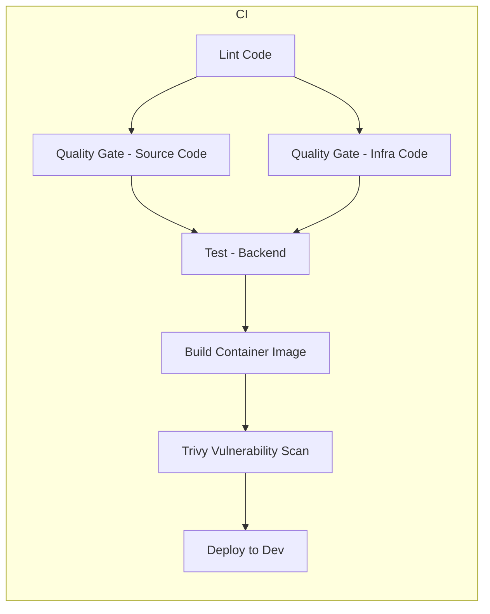

# Digital Step Flow - Backend

Backend Express/Node.js da plataforma Digital Step Flow.

## Stack Tecnológico

- Node.js v24.13.0 com Express
- TypeScript para segurança de tipos
- JWT para autenticação
- bcrypt para hash de senhas
- Zod para validação de schemas
- Helmet para cabeçalhos de segurança

## Imagens de contêiner

A imagem Docker do backend é construída com práticas voltadas à segurança, utilizando **imagem base reforçada (hardened image)**. O Dockerfile usa a imagem base de workloads Node.js 24 (`raphaelmoraes/digital-step-flow-base-node`), que por sua vez é derivada do [Alpine Base](https://hub.docker.com/hardened-images/catalog/dhi/alpine-base) do catálogo Docker Hardened Images (`dhi.io/alpine-base`), com o objetivo de reduzir a superfície de ataque e aumentar a confiabilidade da aplicação.

- **Imagem da aplicação:** construída a partir da imagem base de workload Node.js 24 (hardened). Detalhes de construção e publicação: repositório [pucrs-tcc-digital-step-flow-base-image](https://github.com/raphaelmoraes/pucrs-tcc-digital-step-flow-base-image) (workload `workload/node-24/`).
- **CI/CD:** os jobs de deploy no GitHub Actions (atualização de manifests Kubernetes) rodam no container **CI/CD Runner** (`raphaelmoraes/digital-step-flow-cicd-runner`), que também é construído a partir da imagem hardened Alpine Base e reúne as ferramentas necessárias para CI/CD (kubectl, kustomize, Docker CLI, Trivy, etc.). Detalhes: repositório base-image, diretório `cicd-runner/`.

Os detalhes técnicos de construção, versionamento e publicação das imagens base estão documentados no repositório de base images e neste repositório (Build Docker, GitHub Actions).

## Desenvolvimento Local

### Docker Compose (backend + frontend + Postgres + Redis + observabilidade)

O projeto inclui Docker Compose com backend, frontend, Postgres, Redis, Prometheus, Grafana, Loki e Tempo.

**Pré-requisitos:** Docker e Docker Compose instalados.

**1. Autenticar no registro de imagens (Docker login)**

Antes de baixar imagens da solução ou subir o compose, faça login no registro onde as imagens estão publicadas (por exemplo Docker Hub, para `raphaelmoraes/*`). Se as imagens base usarem outro registro (ex.: `dhi.io`), faça login também nesse registro.

```bash
# Docker Hub (imagens da solução: digital-step-flow-base-node, etc.)
docker login
# Ou: docker login -u <seu-usuario> --password-stdin  (senha via stdin)

# Se usar imagens em dhi.io (ex.: alpine-base hardened)
docker login dhi.io
```

**2. Criar `.env` na raiz do backend (opcional; valores padrão funcionam):**

```bash
cp env.example .env
# Edite .env se quiser (JWT_SECRET, POSTGRES_PASSWORD, GRAFANA_ADMIN_PASSWORD, etc.)
```

**3. Stack completa (backend + frontend em container):**

Clone o repositório do frontend **ao lado** do backend (mesmo diretório pai):

```bash
# Exemplo: se o backend está em ~/git/pucrs-tcc-digital-step-flow-backend
cd ~/git
git clone <url-do-repo-frontend> pucrs-tcc-digital-step-flow-frontend
```

Na raiz do **backend**:

```bash
docker compose up -d
```

**4. Só backend + infra (sem frontend em container):**

Use quando quiser rodar o frontend localmente com `npm run dev` no repo do frontend:

```bash
docker compose -f docker-compose.backend-only.yml up -d
```

**URLs após subir:**

| Serviço     | URL                      |
|------------|---------------------------|
| Backend API | http://localhost:8080     |
| Frontend    | http://localhost:3000     |
| Grafana     | http://localhost:3001 (admin / `GRAFANA_ADMIN_PASSWORD`) |
| Prometheus  | http://localhost:9090    |

As portas seguem a convenção usual da indústria: frontend (UI) em 3000 (padrão de React, Next.js, Vite) e backend (API) em 8080 (comum em servidores e APIs).

**Comandos úteis:**

```bash
docker compose logs -f backend    # Ver logs do backend
docker compose down              # Parar todos os serviços
docker compose down -v            # Parar e remover volumes
```

Detalhes (variáveis, health checks, apenas Node): [docs/local-development.md](./docs/local-development.md).

### Como desenvolver o backend (sem Docker)

1. **Pré-requisitos:** Node.js v24.13.0, npm 11.6.3. Opcional: Docker, PostgreSQL para testes locais.
2. **Instale dependências e suba o servidor:**

```bash
npm install
npm run dev
```

O backend estará em **http://localhost:8080**. Crie um `.env` na raiz (veja [docs/local-development.md](./docs/local-development.md) ou `env.example`).

3. **Scripts úteis:**

```bash
npm run dev          # Desenvolvimento (hot reload)
npm run build        # Build para produção
npm start            # Executar aplicação compilada
npm test             # Testes
npm run test:coverage # Testes com cobertura
npm run lint         # Linter
```

### Desenvolvendo backend e frontend juntos

- **Backend:** `npm run dev` neste repositório → http://localhost:8080  
- **Frontend:** no repositório [pucrs-tcc-digital-step-flow-frontend](https://github.com/raphaelmoraes/pucrs-tcc-digital-step-flow-frontend), `npm run dev` → http://localhost:3000  
- No frontend, use `VITE_API_BASE_URL=http://localhost:8080/api` no `.env` para apontar para o backend local.

## Estrutura do Projeto

```
src/
├── controllers/    # Controladores de rotas
├── middleware/     # Middlewares Express
│   ├── auth.middleware.ts
│   ├── errorHandler.ts
│   ├── requestLogger.middleware.ts
│   └── validateRequest.ts
├── routes/         # Definição de rotas
├── repositories/   # Camada de acesso a dados
├── schemas/        # Schemas de validação (Zod)
├── utils/          # Utilitários (logger, etc.)
└── index.ts        # Ponto de entrada
```

## Kubernetes

Os manifests Kubernetes estão em `k8s/` e incluem:
- Deployment
- Service
- Kustomization (usa remote base do repositório principal)

## Argo CD

A application do Argo CD está em `argocd/application.yaml` e aponta para este repositório.

## Build Docker

```bash
# Build local
docker buildx bake -f docker-bake.hcl --load

# Build com versão específica
docker buildx bake -f docker-bake.hcl --load \
  --set backend.args.BACKEND_IMAGE_VERSION=1.0.0 \
  --set backend.args.BASE_IMAGE_VERSION=1.0.0
```

## Logging

O backend usa logging estruturado em JSON. Veja [docs/logging.md](./docs/logging.md) para mais detalhes.

## Health Check

O endpoint `/health` está disponível para verificar o status do serviço:

```bash
curl http://localhost:8080/health
```

## Versionamento

Este projeto segue [Semantic Versioning 2.0.0](https://semver.org/).

Para criar uma release:
```bash
git tag -a v1.0.0 -m "Release version 1.0.0"
git push origin v1.0.0
```

## GitHub Actions

### Diagrama do pipeline CI

O pipeline CI (`.github/workflows/ci.yml`) roda em **push** e **pull_request** para `develop` e em tags `v*.*.*`:



| Job | Descrição |
|-----|-----------|
| **Lint Code** | ESLint no código TypeScript/JavaScript. |
| **Quality Gate - Source Code** | MegaLinter em código (JS/TS/Bash). |
| **Quality Gate - Infra Code** | MegaLinter em k8s, Dockerfile, YAML; KICS, Checkov, Trivy em infra. |
| **Test - Backend** | Testes com cobertura; upload para Codecov. |
| **Build Container Image** | Determina versão (branch/tag), build e push da imagem Docker. |
| **Trivy Vulnerability Scan** | Escaneia a imagem construída (CRITICAL/HIGH). |
| **Deploy to Dev** | Só em push para `develop`: atualiza manifests k8s de dev com a nova tag. |

### CD (Deploy)

- **Deploy to Dev:** job `deploy-dev` dentro do próprio `ci.yml`; roda apenas em push para `develop` (após Trivy) e atualiza os manifests Kubernetes de dev com a nova tag da imagem.
- **CD Deploy PROD** (`cd-deploy-prod.yml`): workflow dedicado para deploys de produção (ex.: tag ou manual).

## Documentação

- [Desenvolvimento Local](./docs/local-development.md)
- [Logging Estruturado](./docs/logging.md)
- [Versionamento](./docs/versioning.md)
